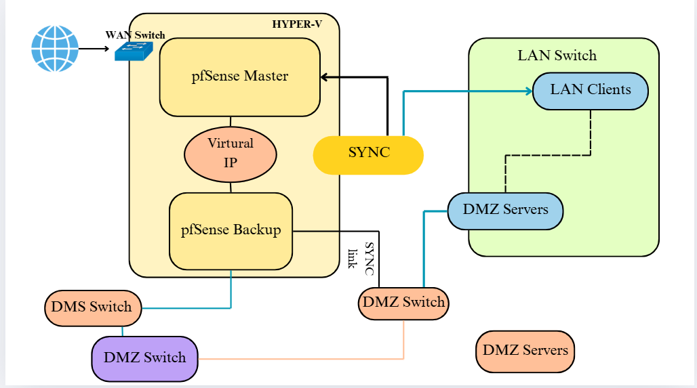

# Hệ thống vận hành và giám sát tường lửa PfSense
## Mục tiêu dự án
- **Firewall & Router**: cài đặt và cấu hình 2 pfSense(Master & backup) với **CARP failover** + **pfsync** + **XML‑RPC sync**.

-   **Quản trị**: Quản lý từ xa qua WebUI và **REST API** (microservice adapter).

-   **Giám sát**: **Prometheus + Grafana** (metrics real‑time), **ELK/Opensearch** (log phân tích), phân loại tấn công (DoS/scan/brute force), biểu đồ tấn công theo thời gian.

-   **Phát hiện & phản ứng tự động (SOAR cơ bản)**: Suricata IDS/IPS → tự động block IP trên pfSense + cảnh báo

-   **Triển khai**: Môi trường **Hyper‑V**.
------------------------------------------------------------------------

## Kiến trúc tổng thể

