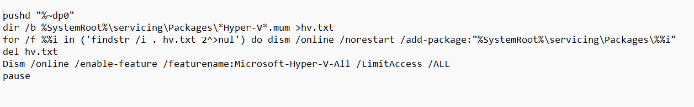
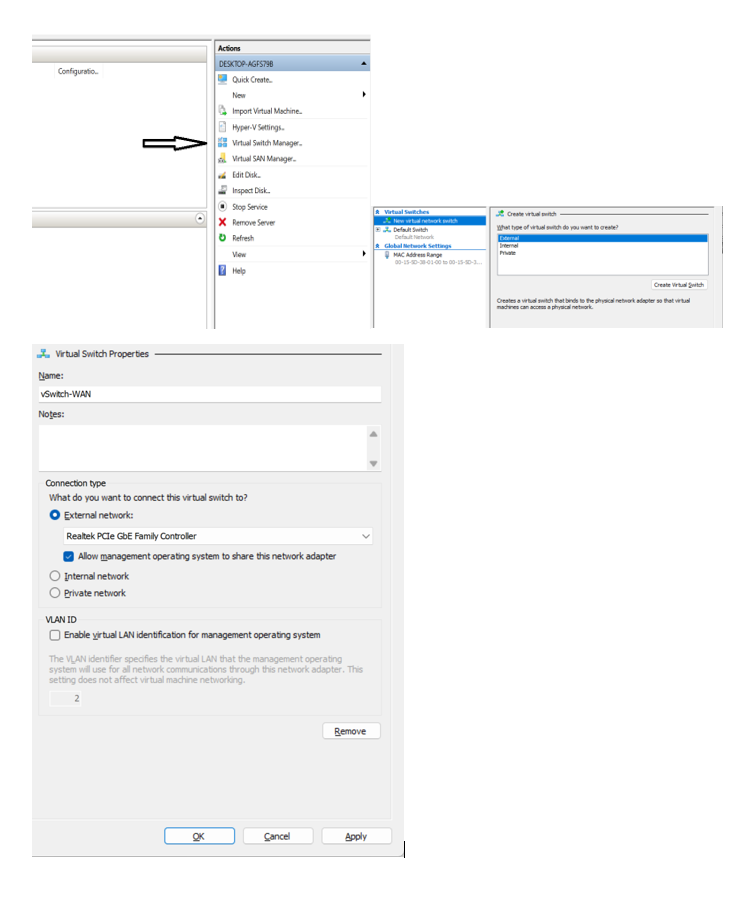
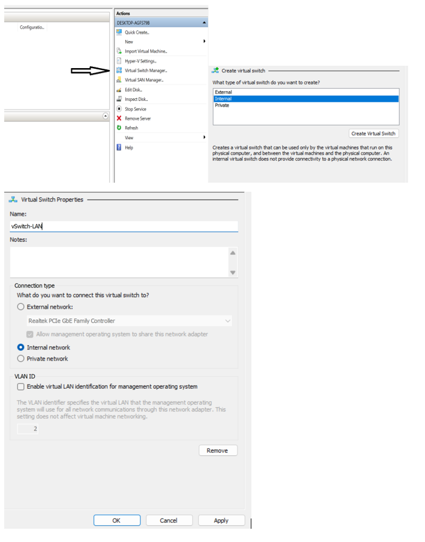
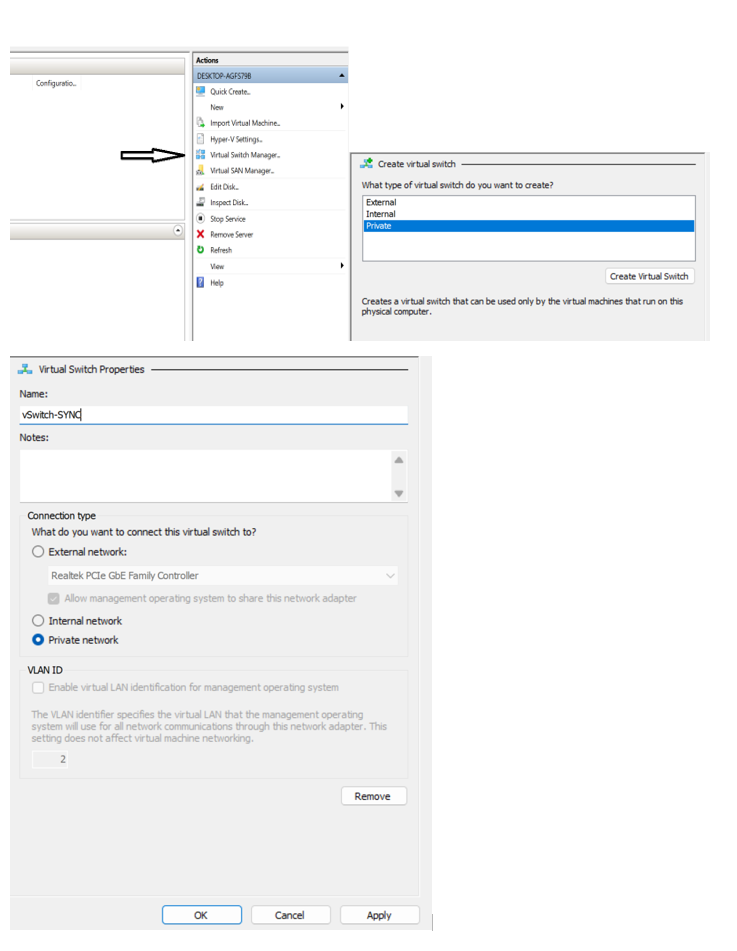

## Chuẩn bị Hyper-V
- Hướng dẫn bật Hyper-V cho window 11 home

    - Tạo file **enable-hyperv.bat** có nội dung như sau:
    
    - Tiếp theo bật Hyper-V trên window theo các bước sau:

        - Mở Control Panel → Programs and Features
        - Chọn Turn Windows features on or off
        - Tick Hyper-V (bao gồm Hyper-V Management Tools)
        - OK → Restart máy

## Tạo 3 Switch(WAN, LAN, SYNC)
- **vSwitch-WAN**: bridge ra card mạng vật lý có Internet

    - Trong **Hyper-V Manager**, panel bên phải → **Virtual Switch Manager…**
    - **New virtual network switch** → chọn **External** → **Create**

        - **Name**: vSwitch-WAN
        - Chọn đúng **card vật lý** có Internet (Ethernet/Wi-Fi) → **OK**
    
    

- **vSwitch-LAN**: host + VM, không đi thẳng ra mạng thật
    - Trong **Hyper-V Manager**, panel bên phải → **Virtual Switch Manager…**
    - **New virtual network switch** → **Internal** → **Create**

        - **Name**: vSwitch-LAN → **OK**
    
    

- **vSwitch-SYNC**: chỉ giữa các VM, dùng cho pfsync/CARP
    - Trong **Hyper-V Manager**, panel bên phải → **Virtual Switch Manager…**
    - **New virtual network switch** → **Private** → **Create**

        - **Name**: vSwitch-SYNC → **OK**
    
    

## Tải ISO PfSense

- Tải file pfSense-CE-2.6.0-RELEASE-amd64.iso
